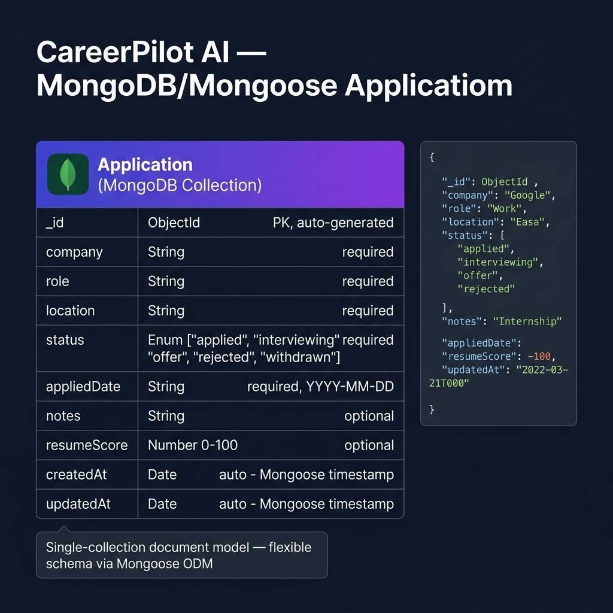

# CareerPilot AI

CareerPilot AI is a full-stack web application that helps students and freshers track job and internship applications, analyze job descriptions, identify missing skills, and prepare smarter for placements.

## One-Line Description

An AI-assisted job application tracker and placement preparation platform for students and freshers.

## Tech Stack

- **Frontend:** React.js + Vite
- **Styling:** Tailwind CSS
- **Backend:** Node.js + Express.js
- **Database:** MongoDB Atlas (via Mongoose ODM) — Week 5
- **API Testing:** Postman / Thunder Client
- **AI Feature:** Gemini API (planned)
- **Authentication:** JWT (planned)
- **Deployment:** Vercel + Render (planned)

## Features

- Job and internship application tracker (Kanban board)
- Create, Read, Update, Delete (CRUD) applications via REST API
- Search applications by company, role, or location
- Dashboard with live stats (total, interviewing, offers, avg resume score)
- Loading states and error notifications
- Dark mode support
- **Week 5:** Persistent storage with MongoDB Atlas — data survives server restarts

---

## Database Choice — Why MongoDB?

We chose **MongoDB Atlas** (via **Mongoose ODM**) for the following reasons:

1. **Flexible Schema:** Application records may have optional fields (notes, resumeScore) that don't always exist — MongoDB's document model handles this naturally without NULL columns.
2. **JSON-native:** Our REST API already exchanges JSON. MongoDB stores BSON (binary JSON), making the data flow seamless from frontend → Express → MongoDB.
3. **Free Tier:** MongoDB Atlas M0 cluster is free forever, ideal for an internship project.
4. **Mongoose ODM:** Provides schema validation, middleware hooks, and a clean query API — bridging the flexibility of MongoDB with the structure our app needs.

---

## Schema Diagram



The schema has **one primary entity** — `Application` — with the following fields:

| Field | Type | Required | Description |
|-------|------|----------|-------------|
| `_id` | ObjectId | Auto | MongoDB primary key |
| `company` | String | ✅ | Company name |
| `role` | String | ✅ | Job role/title |
| `location` | String | ✅ | Work location |
| `status` | Enum | ✅ | applied / interviewing / offer / rejected / withdrawn |
| `appliedDate` | String | ✅ | Date of application (YYYY-MM-DD) |
| `notes` | String | ❌ | Optional notes |
| `resumeScore` | Number | ❌ | Resume match score (0–100) |
| `createdAt` | Date | Auto | Mongoose timestamp |
| `updatedAt` | Date | Auto | Mongoose timestamp |

---

## Set Up the Database

### 1. Create a MongoDB Atlas Account
1. Go to [mongodb.com/cloud/atlas](https://www.mongodb.com/cloud/atlas)
2. Click **Start Free** → create an account
3. Create a new **Project** → click **Build a Database** → choose **M0 Free Tier**
4. Choose your cloud provider (AWS/GCP/Azure) and a region near you
5. Click **Create Cluster**

### 2. Configure Access
1. **Database Access:** Create a DB user — Username + Password (save these!)
2. **Network Access:** Add your IP address (or `0.0.0.0/0` for development)

### 3. Get the Connection String
1. Click **Connect** → **Connect your application**
2. Copy the connection string, it looks like:
   ```
   mongodb+srv://<username>:<password>@cluster0.xxxxx.mongodb.net/careerpilot?retryWrites=true&w=majority
   ```

### 4. Configure Environment Variables
```bash
# In /backend/.env
PORT=5000
FRONTEND_ORIGIN=http://localhost:5173
MONGO_URI=mongodb+srv://<username>:<password>@cluster0.xxxxx.mongodb.net/careerpilot?retryWrites=true&w=majority
```

> ⚠️ Never commit your `.env` file. Only `.env.example` (with placeholder values) is committed.

---

## How to Run the Backend Locally

### Prerequisites
- Node.js v18+ installed
- npm installed
- MongoDB Atlas account (or leave MONGO_URI empty to use in-memory fallback)

### Steps

```bash
# 1. Navigate to the backend folder
cd backend

# 2. Install dependencies
npm install

# 3. Set up environment variables
cp .env.example .env
# Edit .env and add your MONGO_URI

# 4. Start the dev server (with hot reload via nodemon)
npm run dev

# OR start the production server
npm start
```

The backend will be available at: **http://localhost:5000**

### API Endpoints

| Method | Endpoint | Description |
|--------|----------|-------------|
| GET | `/api/health` | Health check |
| GET | `/api/applications` | List all applications |
| GET | `/api/applications/stats` | Dashboard stats |
| GET | `/api/applications/search?q=` | Search applications |
| GET | `/api/applications/:id` | Get single application |
| POST | `/api/applications` | Create new application |
| PUT | `/api/applications/:id` | Update application |
| PATCH | `/api/applications/:id` | Partially update application |
| DELETE | `/api/applications/:id` | Delete application |

---

## How to Run the Frontend Locally

```bash
# Navigate to frontend folder
cd frontend

# Install dependencies
npm install

# Start dev server
npm run dev
```

Frontend runs at: **http://localhost:5173**

> ⚠️ Make sure the backend is running on port 5000 before using the dashboard.

---

## 🚀 Deployment

### Live URLs

| Service | URL |
|---------|-----|
| **Frontend (Vercel)** | https://careerpilot-ai.vercel.app |
| **Backend (Render)** | https://careerpilot-ai-api.onrender.com |

> ⚠️ Replace the URLs above with your actual deployed URLs after completing deployment.

### Tech Stack Summary

| Layer | Technology | Hosting |
|-------|-----------|---------|
| Frontend | React 19 + Vite + Tailwind CSS | Vercel |
| Backend | Node.js + Express.js | Render (Free Tier) |
| Database | MongoDB Atlas (Mongoose ODM) | MongoDB Atlas (M0 Free) |
| Auth | JWT + GitHub OAuth (Passport.js) | — |
| AI Feature | Google Gemini API | — |

### Environment Variables

**Frontend (set in Vercel Dashboard):**
```
VITE_API_URL=https://your-render-url.onrender.com/api
VITE_GITHUB_AUTH_URL=https://your-render-url.onrender.com/api/auth/github
```

**Backend (set in Render Dashboard):**
```
PORT=10000
MONGO_URI=mongodb+srv://...
JWT_SECRET=...
SESSION_SECRET=...
FRONTEND_ORIGIN=https://your-vercel-url.vercel.app
GITHUB_CLIENT_ID=...
GITHUB_CLIENT_SECRET=...
```

### Known Limitations on Free Tier

- **Render free tier spins down** after 15 minutes of inactivity. The first request after idle takes **30–60 seconds** to wake up the backend. Subsequent requests are fast.
- **MongoDB Atlas M0** has a 512 MB storage cap and max 500 connections — more than enough for this project.
- **Vercel** free tier has a 100 GB bandwidth/month limit — not a concern for a demo app.

### Deploying from Scratch

#### Frontend → Vercel
1. Go to [vercel.com](https://vercel.com) → **New Project** → Import your GitHub repo
2. Set **Root Directory** to `frontend`
3. Add environment variables: `VITE_API_URL`, `VITE_GITHUB_AUTH_URL`
4. Click **Deploy**

#### Backend → Render
1. Go to [render.com](https://render.com) → **New Web Service** → Connect GitHub
2. Set **Root Directory** to `backend`
3. **Build Command:** `npm install`
4. **Start Command:** `npm start`
5. Add all environment variables listed above
6. Click **Deploy**

#### Post-Deployment Checklist
- [ ] Update `VITE_API_URL` on Vercel to point to the Render URL
- [ ] Update `FRONTEND_ORIGIN` on Render to point to the Vercel URL
- [ ] Update GitHub OAuth callback URL in [GitHub Developer Settings](https://github.com/settings/developers) to `https://your-render-url.onrender.com/api/auth/github/callback`
- [ ] Whitelist `0.0.0.0/0` in MongoDB Atlas Network Access for Render
